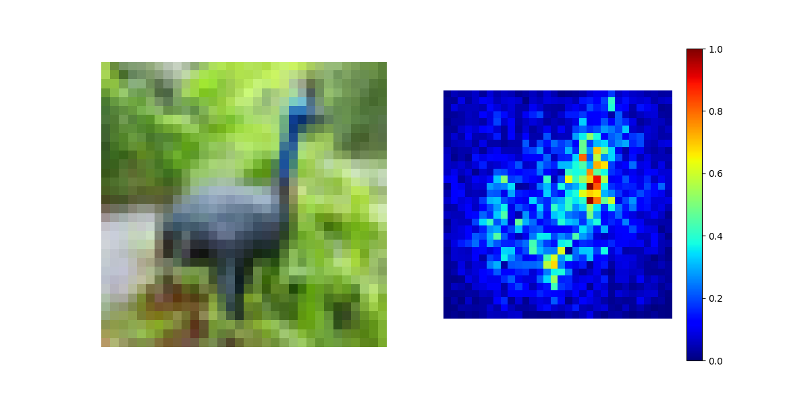

# This is a library for interpreting black box models

Based on: https://christophm.github.io/interpretable-ml-book/

## Example 1

```python
import torch
import torchvision
import torchvision.transforms as transforms
import matplotlib.pyplot as plt

from interpretation.explainer.nn.saliency import SaliencyMap

model = torch.hub.load("chenyaofo/pytorch-cifar-models", "cifar10_resnet20", pretrained=True)
model.eval()

saliency = SaliencyMap(model)
layer = "layer4.0.conv2"

transform = transforms.Compose([
    transforms.ToTensor(),
])

trainset = torchvision.datasets.CIFAR10(
    root='./data', train=True, download=False, transform=transform
)

sample = 6
fig, ax = plt.subplots(1, 2, figsize=(12, 6))

img = saliency.plot_map(
    trainset[sample][0].unsqueeze(0).numpy(),
    int(trainset[sample][1]),
    ax=ax[1]
) 

ax[0].imshow(trainset[sample][0].permute(1,2,0).numpy())
ax[0].axis('off')
plt.show() 
```



## Example 2
```python
import numpy as np
import matplotlib.pyplot as plt
from torchvision import models

from interpretation.explainer.nn.nn_vis import NNVis

model = models.resnet18(weights=models.ResNet18_Weights.IMAGENET1K_V1)
model.eval()
vis = NNVis(model)

fig, ax = plt.subplots(1, 4, figsize=(16, 4))

for i in range(1, 5):
    layer = f"layer{i}.0.conv2"
    
    img = vis.plot_visualization(
        layer_identifier=layer,
        input_shape=(3, 128, 128),
        channel_idx=0,
        max_iter=50,
        ax=ax[i-1]
    )
    
    ax[i-1].set_title(f"{layer}", fontsize=11, pad=8)

plt.tight_layout()
plt.show()
```


## Setting up the repository

Clone the repo
```bash
git clone https://github.com/haydnllh/interpretation.git
```

Set up conda environment:
```bash
conda create -n interpretation python=3.11
conda activate interpretation
```

Install requirements.txt
```bash
pip install -r requirements.txt
```

Install torch depending on your device \
For CPUs:
```bash
pip install torch
```
For CUDA:
```bash
pip install torch --index-url https://download.pytorch.org/whl/{YOUR_CUDA_VERSION}
```

To check CUDA version:
```bash
nvidia-smi
```