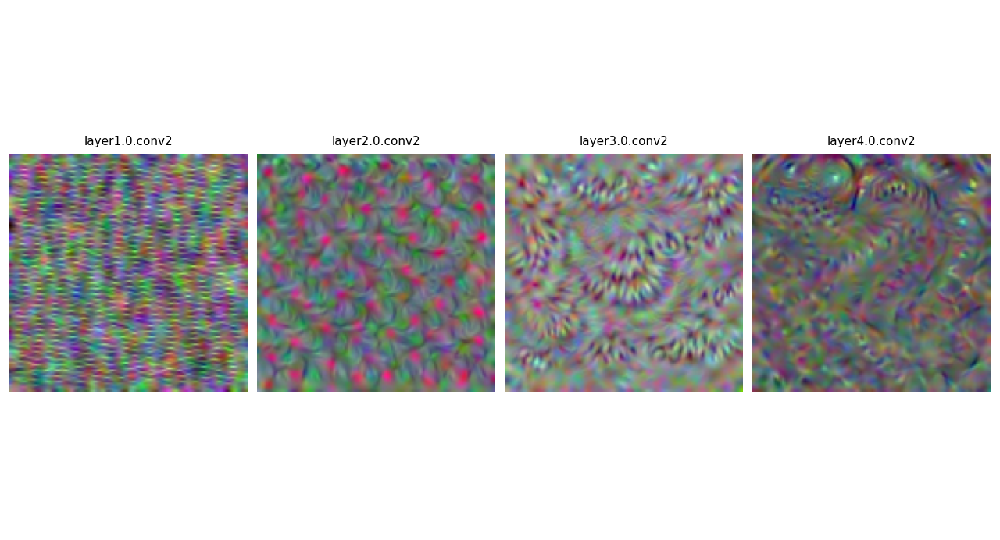

# This is a library for interpreting black box models

Based on: https://christophm.github.io/interpretable-ml-book/

## Example
```python
import numpy as np
import matplotlib.pyplot as plt
from torchvision import models

from interpretation.explainer.nn.nn_vis import NNVis

model = models.resnet18(weights=models.ResNet18_Weights.IMAGENET1K_V1)
model.eval()
vis = NNVis(model)

fig, ax = plt.subplots(1, 4, figsize=(16, 4))

for i in range(1, 5):
    layer = f"layer{i}.0.conv2"
    
    img = vis.visualise(
        layer_identifier=layer,
        input_shape=(1, 3, 128, 128),
        channel_idx=0,
        max_iter=50
    )
    
    img_min, img_max = img.min(), img.max()
    img = (img - img_min) / (img_max - img_min + 1e-8)
    img_disp = np.transpose(img.squeeze(), (1, 2, 0))

    ax_idx = i - 1
    ax[ax_idx].imshow(img_disp)
    ax[ax_idx].set_title(f"{layer}", fontsize=11, pad=8)
    ax[ax_idx].axis('off')

plt.tight_layout()
plt.show()
```


## Setting up the repository

Clone the repo
```bash
git clone https://github.com/haydnllh/interpretation.git
```

Set up conda environment:
```bash
conda create -n interpretation python=3.11
conda activate interpretation
```

Install requirements.txt
```bash
pip install -r requirements.txt
```

Install torch depending on your device \
For CPUs:
```bash
pip install torch
```
For CUDA:
```bash
pip install torch --index-url https://download.pytorch.org/whl/{YOUR_CUDA_VERSION}
```

To check CUDA version:
```bash
nvidia-smi
```